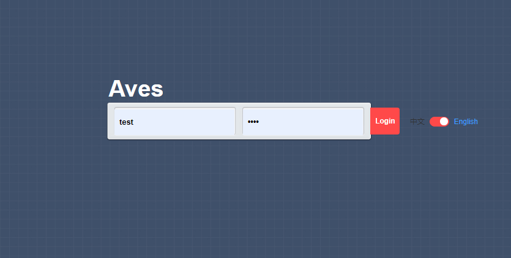

# Aves

a elegance **Vue 2** & **Webpack 5** scaffold without vue-cli.


## Domain Object

- login`login`
- layout`layout`
  - dashboard`dashboard`
  - demo`demo`



## Installation and deployment

```bash
1. git clone https://github.com/uinika/aves.git
2. cd aves
3. npm i
4. npm start
5. Open browser with http://localhost:5000/dev/#/
```

## Thirdparty Library

- [NodeJS 16.13.x](https://nodejs.org/)
- [Vue 2.6.x](https://vuejs.org/)
- [Vuex 3.6.x](https://vuejs.org/)
- [Vue-Router 3.5.x](https://vuejs.org/)
- [Vue-i18n 8.22.x](http://kazupon.github.io/vue-i18n/)
- [Webpack 5.65.x](https://webpack.js.org/)
- [Element-UI 2.15.x](element.eleme.io/)
- [Vuetify 2.6.x](https://vuetifyjs.com/)

## Transfer Protocol

> head

- status: (Integer)，Server-side status
  1. 200：Http response success.
  2. 201：Warning infomation.
  3. 202：Login timeout.
  4. 400: Bad request.
  5. 404: No page found.
  6. 405: Request method is not support.
  7. 415: Unsupported media type.
  8. 500：Server-side exceptions.
- token: (String)，Encryption key。
- message: (String)，Server-side infomation for current http request.
- total: (Integer)，Sum of business logic result (if the results as the object then total equals 1, as an array equals length of the array).

> body

- (Object/Array)，Realistic & available datas.

```javascript
  {
    head: {
      status: 200,
      token: "ghco9xdnaco31gmafukxchph",
      message: "Login Success!",
      total: 1
    },
    body: {
      username: "admin",
      password: "admin"
    }
  }
```

## Project Release

1. Update penguin/sources/partials/common/http.js

> Update base url for global ajax connection.

2. npm run clean

> Remove all of thing within the `output/build`.

3. npm run build

> compile source code to the directory `output/build`.

4. npm run release

> compress build folder to the directory `output/release year-month-day hour.minute.second.zip`.

5. npm run electron

> you must execute `npm start` before activate this command.
